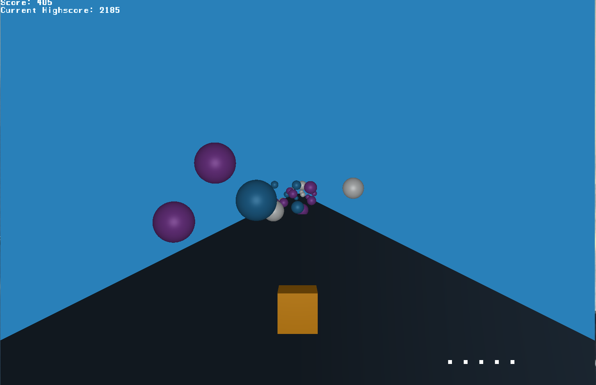

# Bubble Harrier

a game where you need to leap over obstacles or shoot them to get as far as you can

## Screenshot


## How to play

Keyboard                | Action
----------------------- | ------------
<kbd>W</kbd>    | Jump
<kbd>A</kbd>  | Move left
<kbd>D</kbd> | Move right
<kbd>Shift</kbd>        | Shoot


## Precompiled Binaries

Precompiled binaries for Linux and Windows
[https://github.com/andresattler/bubble_harrier/releases](https://github.com/andresattler/bubble_harrier/releases)

## run from source
this game is written in rust and you will need to have `cargo` setup
  
then you can run: 

```bash
cargo run
```
